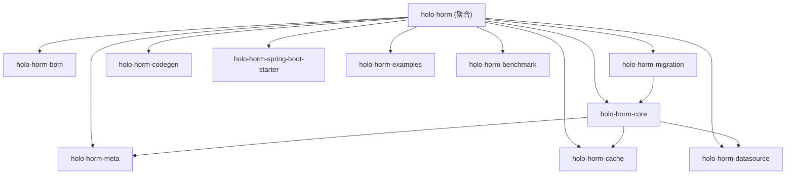

## CodeGraph 使用规则

**在以下任何情况发生时，优先调用 `codegraph_explore` 而不是 `grep`/`find`/`glob`：**
- 需要查找函数、类、变量的定义或引用
- 需要理解代码架构、调用链、模块关系
- 需要追踪"某个功能是怎么实现的"
- 准备用 `grep` 搜索代码库之前

`codegraph_explore` 可以一次性返回相关符号、调用路径和源码，不需要逐个文件读取。

[根目录](../../CLAUDE.md) > **holo-horm**

# Holo :: HORM — Holo Object-Relational Mapping

> 更新时间：2026-07-06 15:24:39

## 模块职责

HORM 聚合 POM，管理 10 个子模块。HORM 是一款采用 Active Record 风格、零反射、多数据源适配、可组合缓存链设计的 Java ORM 框架。

- **parent**: `holo-parent-pom` (1.0.0-SNAPSHOT)
- **artifactId**: `holo-horm`
- **version**: `1.0.0-SNAPSHOT`
- **packaging**: pom
- **group**: `com.holo.framework`

### 模块结构图



## 子模块清单

| 子模块 | 类型 | 职责 | 源代码状态 |
|--------|------|------|-----------|
| [holo-horm-bom](./holo-horm-bom/CLAUDE.md) | pom | HORM 内部模块版本清单 | 无源码 |
| [holo-horm-meta](./holo-horm-meta/CLAUDE.md) | jar | 注解定义 + APT 处理器，编译期生成元数据 | 已完成 (M1-M8.7) |
| [holo-horm-core](./holo-horm-core/CLAUDE.md) | jar | 核心 API：Model、Query、Repository、Transaction | 已完成 (M1-M8.5) |
| [holo-horm-cache](./holo-horm-cache/CLAUDE.md) | jar | 缓存链系统（L1 Caffeine + L2 Redis stub） | 已完成 (M6) |
| [holo-horm-datasource](./holo-horm-datasource/CLAUDE.md) | jar | 数据源 SPI 与参考实现 | POM 已建，无源码 |
| [holo-horm-migration](./holo-horm-migration/CLAUDE.md) | jar | 数据库迁移工具（Flyway 集成） | 已完成 (M7) |
| [holo-horm-codegen](./holo-horm-codegen/CLAUDE.md) | jar | 代码生成 CLI | POM 已建，无源码 |
| [holo-horm-spring-boot-starter](./holo-horm-spring-boot-starter/CLAUDE.md) | jar | Spring Boot 自动装配 | 已完成 (M8) |
| [holo-horm-examples](./holo-horm-examples/CLAUDE.md) | jar | 示例代码 | POM 已建，无源码 |
| [holo-horm-benchmark](./holo-horm-benchmark/CLAUDE.md) | jar | JMH 性能基准 | 已完成 (M9) |

## 里程碑状态

| 里程碑 | 主题 | 状态 |
|--------|------|------|
| M1 | 元数据 SPI 与 APT 流水线 | 已完成 |
| M2 | 查询构建器与条件查询 | 已完成 |
| M3 | 关联关系映射 | 已完成 |
| M4 | 事务管理 + 级联 + 批量操作 + 乐观锁 | 已完成 |
| M5 | 多数据源 SPI 与路由 | 已完成 |
| M6 | 缓存链（L1 + L2 组合）+ batch loading | 已完成 |
| M7 | 数据库迁移（Flyway 集成） | 已完成 |
| M8 | Spring Boot Starter + @Transactional AOP | 已完成 |
| M8.5 | 数据库方言适配（MySQL/PostgreSQL/H2） | 已完成 |
| M8.7 | 零反射优化 — 编译期代理生成与反射消除 | 已完成 |
| M9 | 性能基准与 GA 发布 | 已完成 |

## 构建命令

```bash
# 安装父 POM 和 BOM（首次）
mvn -f ../holo-parent-pom/pom.xml install
mvn -f ../holo-dependency-bom/pom.xml install

# 单模块验证
mvn -pl holo-horm-meta,holo-horm-core,holo-horm-cache -am verify -Pskip-enforcer

# 全部验证
mvn verify -Pskip-enforcer

# JaCoCo 聚合报告
mvn verify -Pjacoco-aggregate

# 跳过 Enforcer
mvn compile -Pskip-enforcer
```

## 关键设计决策

1. **Active Record + 零运行时反射**: APT 编译期生成伴随类，运行时热路径零反射
2. **CRTP 模式**: `Model<T extends Model<T>>` 泛型自引用
3. **多数据源 SPI**: DataSourceRegistry 管理命名数据源，@Entity(dataSource = "...") 驱动路由
4. **可组合缓存链**: L1→L2→L3 责任链模式，支持 LRU/TTL/写穿透等策略
5. **Query 模型数据源无关**: 通用 Query 描述意图，各数据源 Translator 翻译为原生命令
6. **AOT 兼容**: 无运行时字节码生成，兼容 GraalVM Native Image

## 文档

- `docs/00-research.md` — 技术调研报告
- `docs/01-architecture.md` — 架构设计
- `docs/02-zero-reflection.md` — 零反射实现方案
- `docs/03-multi-datasource.md` — 多数据源适配
- `docs/04-cache-chain.md` — 缓存链系统
- `docs/05-active-record.md` — Active Record API
- `docs/06-extension-features.md` — 扩展特性
- `docs/07-performance-security.md` — 性能与安全
- `docs/08-dialect-adaptation.md` — 数据库方言适配
- `docs/09-zero-reflection-optimization.md` — M8.7 零反射优化设计
- `docs/10-quickstart.md` — 5 分钟快速上手
- `docs/11-user-guide.md` — 完整用户指南
- `docs/12-migration-guide.md` — 从 MyBatis/Hibernate 迁移指南
- `docs/13-benchmark-results.md` — 性能基准报告
- `docs/14-aot-graalvm.md` — AOT / GraalVM Native Image 兼容性
- `docs/PROGRESS.md` — 开发进度与里程碑

## 相关文件清单

| 文件路径 | 说明 |
|---------|------|
| `holo-horm/pom.xml` | 聚合 POM 配置 |
| `holo-horm/docs/` | 技术文档目录 |
| `holo-horm/docs/diagrams/` | 架构图源文件 (PlantUML) |
| `holo-horm/docs/PROGRESS.md` | 开发进度文档 |

## 变更记录

| 日期 | 变更 | 说明 |
|------|------|------|
| 2026-07-06 | 初始文档生成 | 架构扫描 |